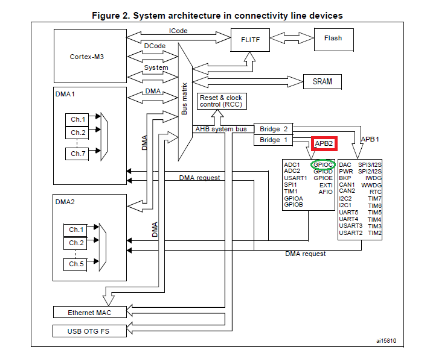
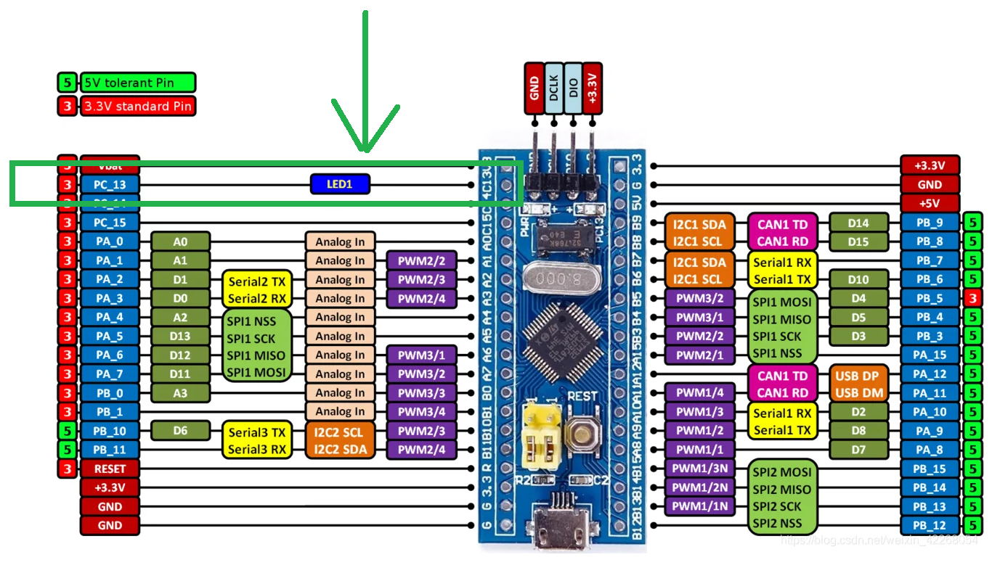

# Electrónica IV - TP 6 - HAL Parte 1 - Memoria de Diseño

Alumno: Facundo Sonzogni

## Especificacion 
El objetivo del práctico es diseñar una Capa de Abstracción de Hardware (HAL) que permite controlar 
el temporizador y los pines de entrada/salida del bluepill. Luego, se implementará para hacer parpadear un led cada 500 ms.

## Capa de abstracción de Hardware

### Pines de entrada/salida
Los pines de entrada/salida son controlados por el periférico GPIO conectado al bus periferico APB2 del micocontrolador. Los periféricos de los buses APB1 y APB2 CUENTAN CON UNA HABILITACIÓN DE RELOJ comandada por el periferico RCC (Reest and Clock Control), que permite controlar la frecuencia del reloj (oscilador a cristal). Para utilizarlo, debemos primero activar el reloj.



El micro tiene puertos de A hasta E, pero en la bluepill solo se puede acceder a los puertos A hasta C. Implementaremos primero las características estrictamente necesarias para completar el programa de parpadeo, por lo cual averiguamos el puerto y pin donde esta conectado el led integrado en la bluepill. En la siguiente imagen, se observa que eL LED esta em el PC13 (PIN 13 DEL PUERTO C) y es el que debemos configurar. 



Según el manual de referncia de la familia del mcirocontrolador (RM0003, 2021, seccion 1.3.7) el reloj del puerto GPIOC se habilita poninendo en 1 el bit 4 (IOCEN) del registro de offset 0x18 (APB2ENR) en el periferico RCC, de direccion base 0x40021000 segun (hoja de datos STM32F103x, 2015).

### Habilitacion de Reloj del Puerto

Listado 1. Operaciones de máscara
Para poner en 0 en 1 bits individuales de un registro es necesario hacer una operacion de máscara
*Operacion de mascara:* Es una operación que permite poner en 0 en 1 ciertos bit de una determinada palabra:

```c
//Para poner en 0: 
    palabra = (palabra & not MASCARA_RESET) 
//Para poner en 1:
    palabra = (palabra or MASCARA_SET)
```

DONDE: MASACARA_RESET tiene en 1 los bits que interesa poner en 0
       MASCARA_SET tiene en 1 los bits que interesa poner 

Listado 2. Muestra el codigo de habilitacion de reloj del puerto GPIOC (usando las definiciones en 'stm32fio.h')

```c
static void habilitarRelojPuertoC(void)  //Static significa que tiene vinculacion interna. No es visible fuera del archivo. 
{  
    RCC->APB2ENR = RCC->APB2ENR or RCC_APCB2ENR_IOPCEN //Operacion de Máscara
}
```

## Interfaz abstracta para controlar un pin

Según el enunciado, nuestra interfaz abstracta no puede incluir ningún detalle sobre el hardware (fuera de las funciones mismas) o la librerías del fabricante.
Para ello, utilizaremos el concepto de *"handle"* para referirse a recursos de forma abstracta (Referencia: Handle, 2021). De esta manera, definiremos los handle que permiten acceder a los pines como miembros de un tipo *enum* de c

Listado 3. Handles y operaciones para referirse a los pines
```c
// Aqui tus definiciones de tipo Y constantes
typedef enum HPin{
    Pin_LED, PinPC13=Pin_LED
    Pin_NUM_HANDLES
}HPin;
```
### Referencias

- <https://reversepcb.com/stm32f103c8t6/>
- Hoja de datos STM32F103x (agosto 2015) ST.


